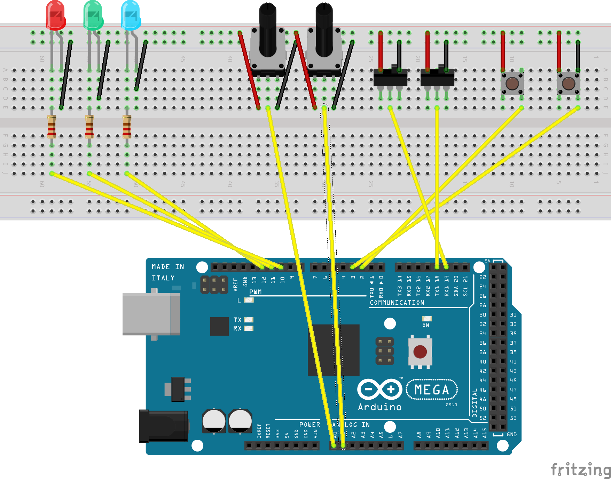

---
output: pdf_document
title: Executive Summary, Phase 1
author: Kevin Destin and David Janowsky
geometry: margin=0.75in
fontsize: 10
export_on_save:
  pandoc: true
--- 

 1. **A description of the deliverable, its functionality, and demonstration**

The goal of Phase 1 was to create a circuit modeling a statemachine and to
develop a first draft of the bot spec for the bot that we would create along
the semester.

### State Machine
  The state machine was required to have the following states

 * On: Blinks Red LED at 10Hz
 * Off: No functionality
 * Run: Both Max intensity and frequency can be modulated by potentiometers
   * Default: Fade Green Led (spec referes to Blue led, but this is probably a
     mistake) for 6 seconds. Flash 2 times at 1Hz
   * On Switch 1 Rising Edge: Flash at 10Hz
   * On Switch 2 Falling Edge: Turn on Red LED
 * Sleep: Flash Blue LED at 4Hz for 1 second. Fade for 1 second. Repeat
 * Diagnostic:
   * Mode 5: Blinks Red LED 5 times to indicate 5 problems
   * Mode 8: Blinks Red LED 8 times to indicate 8 problems 

  Two potentiometers control the frequency and maximum brightness of the Green
  LED while in the run state. 

  We took several liberties while planning the functionality of the state
  machine. 

  The spec made no mention of how to implement state transitions, so we went
  with the most simple solution, and did a round robin (On -> Run -> Sleep ->
  Diagnostic). State transitions were triggered by button press. At any time,
  the user could push a second button to enter the off state and pressing the
  button once more would then return them to the On state.

  In the Diagnostic Phase, the spec makes no mention of what triggers Mode 5 or
  Mode 8, so we had it toggle between the two upon entry to the state.
  
  The spec also suddenly refers to a Blue LED as if it were the green led
  aforementioned. We took that as an error and worked as if all mention of a
  Blue LED was the Green LED.

### Bot Spec
  
  We followed the listed guided to provide a draft specification for the bot we
  would build.

 2. **The duration of the design tasks for the phase showing the original
    planned dates and any delays or changes from the original projections.**

State Machine was started on 1/17. We estimated that we could finish on 1/25.
We were able to complete the State Machine a day early and deliver on 1/24.

The bot spec was started after we delivered the the state machine on 1/25. We
projected that we could finish on 1/29, but later revised that date to 1/30. We
delivered on 1/30.
   
 3. **A brief description of the conceptual and design activities.**

Conceptual and Design Activities revolved around the completion of the
Prestudio assignements. Prestudio assignments provided the initial push to
start thinking about how we would approach this design sprint, like the problem
we were trying to solve and the requirements that we would have to meet. 

Once finished with the Prestudio assignments, we would also meet to discuss and
plan all the details of how we would implement the state machine.

 4. **A short technology summary of the theory of operation for the team’s design, 
any drawings,  sketches,  schematics,  block  diagrams, and flow  charts  to
clarify  the design that are appropriate to convey the design intent of the
team**

 
 Our circuit performed none of the logic for the state machine, instead relying
on the microcontroller.

The software modeled the state machine as a list of states (functions). Global 
variables served to record the current state of the machine (current state,
whether the board was on, whether it should switch to a new state, etc...).
Each of the state functions defined the corresponding behavior of the state
machine, as described in the section on functionality. The buttons were associated with interrupt service routines that
either cycled through the current state, or toggled the power state of the
state machine.

 5. **A   complete   list   of   the   experiments   performed,   the   success
or   failure,an assessment  of  the  quality  of  the reflection on failure,and
the  learning  that occurred from the experiments. Consult the reflection on
failure rubric to perform the assessment.**

To verify that we had a circuit that met the spec, we designed several tests to
verify the functionality of our circuit

### Fade Test

In software, we designed a subsystem that could smoothly modulate the
brightness of an LED between two brightness values over a specified period of
time. To perform this test, we had to qualitatively judge the brightness of the
LED and the transitition, but we used a chronometer to measure the duration of
the transition. We encountered several failures before we were satisfied with
the results. We ran into the problems that the LEDs would sometimes flicker
instead of smoothly transitioning, and that the LEDs wouldn't shine brightly
enough. With debugging we found the flickering was due to us forgetting to tie
the groudn on the microcontroller to the ground of the powersupply that we were
using to power the LED. By using analogWrite instead of digitalWrite, we were
also able to get the brightness of the LED to an acceptable level.

### Blink Test

We also used software to develop a subsystem that could flash on LED at a given
frequency. To test this, we had the microcontroller output the current time in
milliseconds over a serial connection every time it lit the led. We could then
determine the period of the flashing, and from there the period. We encountered
no significant failures in this test

### State Transition Test

We then ran several tests to verify that we could transition between all states
in a round robin fashion, enter the off state from all of them, and
subsequently enter the run state. We had an initial failure where instead of
going from the last state (Diagnostic) to the first state, our program would
instead hang before the board reset itself. This was due to an order of
operations error preventing a modulo operator from performing as expected.

### State Functionality Test

We went through each state to verify that each state functioned according to
spec. This was trival for the ON, and Sleep state, since they solely depended
on Fade and Blink which we had already tested. We set Diagnostic to toggle
between Mode 5 and Mode 8 each time we entered that state. We went through all
of the behavior required for the run state, verifying that the various triggers
(potentiometers and switches) produced the correct effect. There were no
significant failures during this testing phase.

 6. **A list of who was assigned which tasks and the quality of their work.**

  General Design Tasks (Prestudio) were divided equally between all
  team members. Our design was well suited for the spec and allowed for
  efficient completion of the deliverable.

  Circuit Design - David Janowsky. The circuit worked perfectly and performed
  all required tasks to spec.

  Software Design - Kevin Destin. The software was adequate and also met the
  spec. 

  Bot Spec was completed as a team and resulted in a good first draft.

 7. **The cost of the  bot by phase to-date versus its estimated cost.**

Not applicable. We incurred no costs directly related to bot construction in
this phase. 

 8. **Team stage assessment: strengths, weaknesses, difficult personality types
present on the team, improvement plan, and success of respect and working
together.**

As a whole, the team is functioning well. We are respectful of each other,
communicate well, and are respectful of each other's time. We are able to
bounce design ideas off each other well, discussing the merits of various ideas
to finally settle on the best ones. We have not faced problems related to
personalities, but moreso in terms of expertise. Both team members have
strengths skewed to either facets of this project (hardware and
software). As such, it has been the natural to divide the work along those
lines, allowing each member to work at what they are best at. The disadvantage
has been that this limits each members exposure to the topic they are weaker
at. 

  
 9. **Recommendations  to  the  next  project  leader  on  how  team  operation
and  design work may be improved.  For subsequent executive summaries after the
first one, a statement  of  how  the  recommendations  were  implemented,  or
the  reasons  for discarding them must be included.**

It would probably be worth having each team member switch to the part of the
project they are less apt to.
