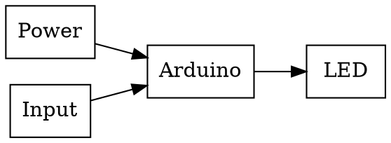
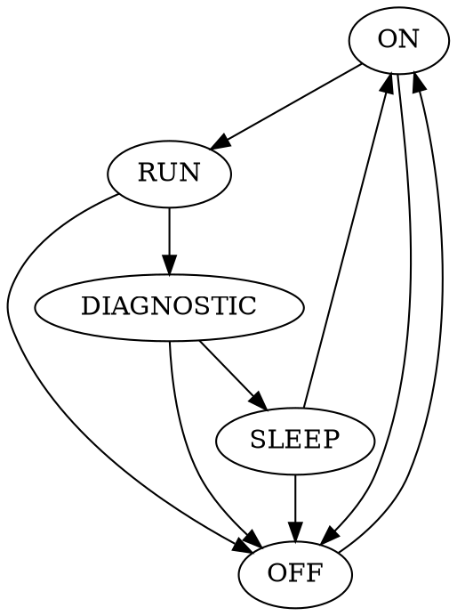
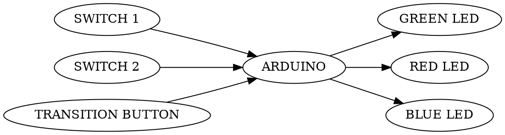

Think:
 1. We're trying to create a swarm bot 
 2. Customer: Course Staff
        Object 
 3. Aesthetic 
    Functionality
    Cost 
 4. "If it doesn't work, it doesn't matter": We must prioritize functionality
    over  everything else
    We will test driven development. 
 5. Path finding and follow
    Detect Collision
    Prevent Collision
    Bots should be able to communicate with other bots and the TTC
    Has to be automonous
 6. 
    The functionality of path finding and following is color detection

    The functionality of collision avoidance is magnectic field detection

    The functionality of collision detection is jerk detection

    The functionality of communication is ultrasound speakers and microphones

    The functionality of automous is the microcontroller and the motor system

Plan:
 1. Success looks like having a bot that meets all our design requirements
 2. The penultimate step would then be to verify that our swarmbot 
 3. Follow the syllabus
        State machine
        Motor
        Sensor
        Collision Detection Spec
        Go Beyond

 Implement various subsystems
        Color deteci

 
 
  For each subsystem, we would iterate throught the state machine given at 
    the top of the page:
        - think about the system we want to implmenet
        - plan how we want to implement
        - implement
        - test
        - reflect on the implementation

Do:
 1. Where: Halligan
 2. Time: much

Test:

 1. Everything whenever new functionality is added
 2. Objective:
        Resources
        Equipment
        Processes
 3. Our bot
    Multimeter
    Stopwatch
    Test track
    Magnets
 4. All functoinality that's implemeneted

Reflect:

 1. Failure is an indication that part of our plan was faulty. We'll use
    failure as a feedback mechanism to iterate on our plan.

 2. No

 Team: 

 1. Me: Maybe
    Him: Maybe
    Strategy: Follow decision making process, rember that there are no perfect
              decisions

 2. Not being late
    Being nice
    Keep in mind that we are both maybe people

 3. In notebooks
 4. To course Staff
 5. The value proposition for this project is getting a better feel of
    of working in industry. We will have to work with deadline, plan, implement
    a project, report to a manager, etc...

Safety is the number one priority

Arduino

1. the particular condition something is in at a specific time.
2. A statemachine is a machine that can only be in one of a predetermined
states at a given time
3. An interrupt is a signal from hardware indicating that some event must be
handle
4. We are trying to model a state machine using an Arduino
5. Turn LEDs on and off and change brightness
6. Check the spec
7. Arduino Programming Language
   Arduino Environment
   Potentiometer
   Kirchoff 
8.



9.   asd
10.  as
11.  as
12.  as
```c
while(1){
        LED ON
        wait();
        LED OFF 
}
```

13. as
```c

```

14. Code is in arduino, RC are in the led block
15. Button cycles through cycles

16. 

17.  This does run
     mySerial is undefined (did you mean theSerialPort?) 
     It sets up two serial connections, and forwards everything read from one
     connection to the other.

18. 0.039" +- 0.01"
    costs .12 cents

19. Tatings is a misspelling of "ratings"

20
Forward Voltage
Typical = 1.8
Max = 2.4

Test Conditions:

$I_f = 20ma$

$T_a = 25 C$

21  7-8 ma

22. 650-675nm
The unit is of luminous intesity is mcd (milli candela)

23. We both have experience writing software so we expect the software to work.
We are less confident about the circuit that we will build.

24 


 * objectives: Verify that button cycles through all the states in order
 * resources:
 * equipment: 
 * processes:

 * objectives: Verify that the system powers on to the ON state
 * resources:
 * equipment:
 * processes:

 * objectives: Verify that each state functions as defined
 * resources:
 * equipment:
 * processes:

Task:

1. Me and my partner plan to take equal responsibility in design 
2. I plan to take more of a lead on building software and testing software
3. AVR-GCC (compiler for arduino)