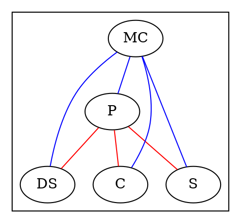

```dot
graph G{
        subgraph cluster_0{
                P -- DS[ color = red]
                P -- C [ color = red]

                MC -- P [ color = blue ]
                MC -- DS [ color = blue ]
                MC -- C [ color = blue ]
                        P -- S [ color = red ]
                        MC -- S [ color = blue]

        }
}


```
Power module -> power to other modules 

Microcontroller <- status from all
                -> control all others

