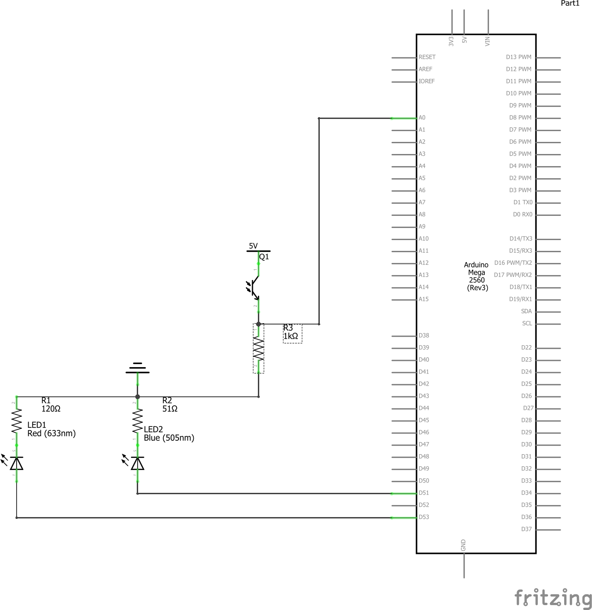
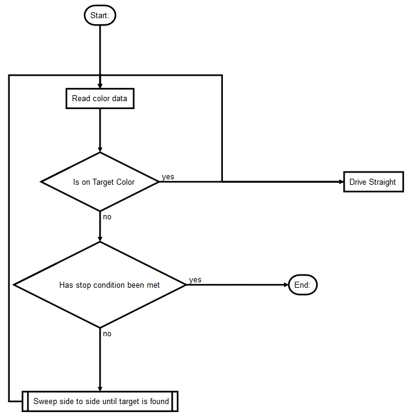
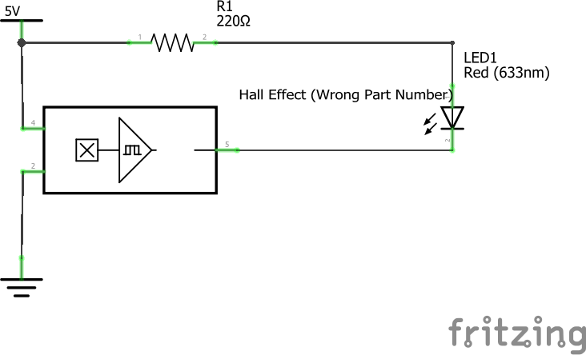

\newpage
# **A description of the deliverable, its functionality, and demonstration**

The goal of Phase 3 was to implement the color sensor and hall sensor and
contract a team to create a collision detection system

### Sensors

#### Color Sensor

We were tasked with integrating a colored light sensor with the Arduino, that
needed to detect red, blue, and yellow.

The deliverable for this section were the following demos
 
 * Move robot forward and stop on blue
 * Move the bot in a straight line along a strip of blue paper.
 * Move bot along a curved path, ultimately turning 90 degrees
 * Turn right on red and left on blue
 * Move along a blue line, turn right on red, stop on yellow patch. 

#### Hall Sensor

We were also tasked with creating a circuit that lit an led when a hall sensor
was in the presence of a magnetic field.


### Collision Detection Spec

We were also tasked with outsourcing a collision detection system to another
design team. The deliverable for this requirement was the specification
document.

# The duration of the design tasks for the phase showing the original planned dates and any delays or changes from the original projections.

Work on phase 3 began after the completion of phase 2, delivered on 2/7.
We projected that we'd be finished with phase 3A on 2/26 and phase 3B on
2/19 as suggested by the schedule. 

We started working on phase 3A initilially, and were able to read data
from the color sensor properly. We then switched gears to the collision
detection spec during the week of Feb 12, in order to deliver the spec by
our projected date. 

On 2/19, we returned to working on reading data from the color sensor
along with completing the circuit for the hall sensor.

From then onwards, we spent time working on the algorithm for the line
following demo. Due to some delays and David being in China for a 
conference for a week, we had to delay our demo of 3A by 3
days to 3/1
     
# A brief description of the conceptual and design activities.

Conceptual and Design Activities revolved around the completion of the
Prestudio assignements. Prestudio assignments provided the initial push to
start thinking about how we would approach this design sprint, like the problem
we were trying to solve and the requirements that we would have to meet. 

Once finished with the Prestudio assignments, we would also meet to discuss and
plan all the details of how we would implement the the various circuits, along
with the components of our collision detection system

# A short technology summary of the theory of operation for the team’s design, any drawings,  sketches,  schematics,  block  diagrams, and flow  charts  to clarify  the design that are appropriate to convey the design intent of the team

## Color Sensor

### Circuit



The color sensing circuit was not very complicated. All that was required was
that the leds could receive a high voltage from the Arduino, and that the value
from the color sensor could be read.

We calculated resistor values for the LEDs to maximize their light output.

### Algorithm

<!-- For some reason, Markdown Preview Enhanced won't render this -->
<!-- ```flow 
st=>start: Start:
read=>operation: Read color data
cond=>condition: Is on Target Color
cond2=>condition: Has stop condition been met
en=>end: End:
straight=>operation: Drive Straight
findColor=>subroutine: Sweep side to side until target is found

st->read->cond(yes,right)->straight
cond(no)->cond2(no,bottom)->findColor->read
cond2(yes)->en
straight(left)->read
findColor(left)->read
``` -->



In our program, we represented color as a triplet of values: the sensor
readings when only the red led is on, only the blue led is on, and when both
are on. We stored calibration values for each of our target colors.

We implemented a simple line following algorithm for our demonstration. In more
conventional line following applications, there is typically an array of
sensors use to determine the bot's position relative to the line it is
following. Since we only had one, the challenge in line following revolved
around how to recover when the bot inevitably went off course. Since the bot
had no way of knowing whether it should turn left or right, we had it do both
until it found the color that it was trying to follow. By sampling colors
frequently enough, this allowed our bot to follow lines well. It even was able
to complete to zigzaged "human robot" test track on the ground in lab 225.

Depending on the challenge, we specified different stopping conditions for the
algorithm (if current color is yellow, if color not target color, etc...) 


## Hall Sensor


The complexity of working with the hall sensor was identical to the color
sensor; we a minimal circuit to probe the sensor value, here with an LED to
indicate whether the sensor could detect a magnetic field.

## Collision Detection 

The design document stated that we needed to detect collisions in all
directions. But after some deliberation and some guidance from Prof. Lasser, we
decided that it was only necessary to detect collisions from the front and back
and omitted any requirements for the sides.

What follows is an exerpt from our collision detection spec: 

"We would like you to create twelve bumpers for us. Each bumper consists of a
1.5x1.5in square of foam board attached to a switch.

#### Milestones / Deadlines

One bumper should be prototyped by 2/22/2019. 

All remaining bumpers must be delivered on day prototype meets the
specification. This must be on or before 2/26/2019.

#### Acceptance test criteria

 (1) Fragility Test

  Structural integrity is of paramount importance to us. Therefore we expect
  the product to be well constructed. We will perform a test to verify the
  sturdiness of the product. We will drop the product off of a 225 lab bench,
  and verify that it does not break, and that it still functions correctly in a
  simple circuit (test 2).

 (2) Functionality Test

  We need the product to work. We will integrate it into a simple led circuit
  to verify that the product allows us to detect when the switch is actuated."

# A   complete   list   of   the   experiments   performed,   the   success or  failure,an assessment  of  the  quality  of  the reflection on failure,and the learning  that occurred from the experiments. Consult the reflection on failure rubric to perform the assessment.

## Color Sensor

 (1) Color Differentiation

We started by making sure that our bot could in fact tell the difference 
between the calibrated colors. This test consisted of first calibrating 
the bot, then continuously printing the color read by the sensor on the 
serial monitor. Some failures in the test caused us to rethink the way that 
we identified colors. We initially read colors as triplets, and intepreted
them as vectors. To determine the current color, we would determine the 
cosine of the current color vector with each of the reference vectors, and
return the color that had the largest cosine (i.e both vectors point
the same way). This proved inadequate, as blue and black "point the same 
way" and are instead differentiated by magnitude of the vector. We then
resorted to using the difference between the current and reference vectors
instead.
    
  (2) Line following 
  
All the other challenges revolved around being able to
follow a line accurately, so our test fixture consited of the provided test
fixtures along with the zig zag tape pattern on the floor of lab 225. Our
testing didn't reveal any major failures, but instead allowed us to tune
various parameters of our algorithm for better performance. 

## Hall Sensor
  (1) Turns on in presense of magnetic field

This test was somewhat trivial, as it essentially was passed once we
implemented the circuit correctly.

## Collision Detection System

 (1) Fragility Test

We veried the structural integrity of the system delived to us.
We dropped the product off of a 225 lab bench, and it infact did not break
and still functioned perfectly.

 (2) Functionality Test

We integrated the bumped it into a simple led circuit and  verified that 
the product allows us to detect when the switch is actuated.


# A list of who was assigned which tasks and the quality of their work

General Design Tasks (Prestudio) were divided equally between all team
members. Our design was well suited for the spec and allowed for efficient
completion of the deliverable.


Circuit Design - David Janowsky. The circuit worked perfectly and performed
all required tasks to spec.

Software Design - Kevin Destin. The software was adequate and also met the
spec. 

Collision Detection spec was completed as a team and resulted in a good first
draft.

# Incurred Costs

## Labor 

 $$20hr * \frac{50\$}{hr} + 10hr * \frac{50\$}{hr} = \$1500$$

## Parts

$$\text{Hall Sensor} =  \$2.52\text{ each}$$
$$\text{Photosensor} =  \$3.77\text{ each}$$
$$\text{LED} =  2 * \$0.12\text{ each}$$

## Contractors 

 * The switches cost $\$2.16$.
 * The foam board and glue should cost $\approx\$1.00$. 

So we expect parts to cost $\$2.16 * 12 + \$1.00= \$26.92$.

 * The assembly rate is $\$30.00$.

We expect you to work for 1 hour.

So the final cost should be $2 * \$30.00 + \$26.92 = \$86.92$

# Team stage assessment: strengths, weaknesses, difficult personality types present on the team, improvement plan, and success of respect and working together.

As a whole, the team is functioning well. We are respectful of each other,
communicate well, and are respectful of each other's time. We are able to
bounce design ideas off each other well, discussing the merits of various ideas
to finally settle on the best ones. We have not faced problems related to
personalities. We worked well as a team, and for the most part were able to
plan around one member being away for an extended amount of time.

  
# Recommendations  to  the  next  project  leader  on  how  team  operation and  design work may be improved.  For subsequent executive summaries after the first one, a statement  of  how  the  recommendations  were implemented,  or the  reasons  for discarding them must be included.

No recommendations

